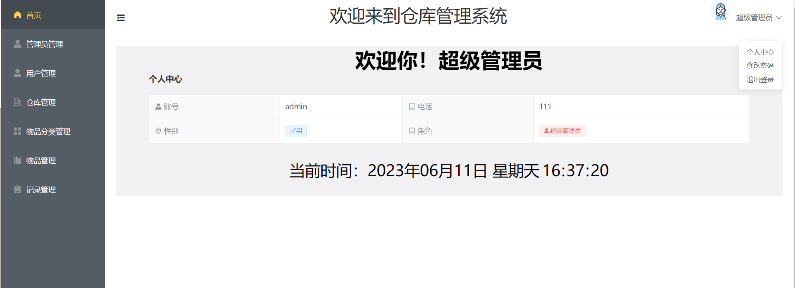
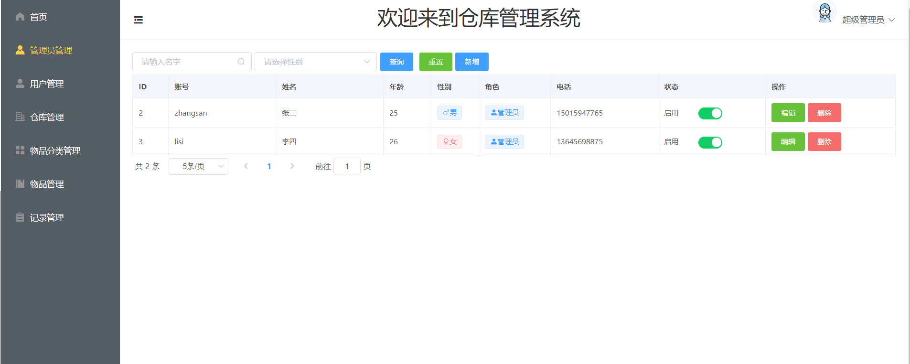

# WMS 仓库管理系统

## 1. 项目概述

该项目为我期末大作业，也是我的第一个SpringBoot 项目，该项目拿来作为 SpringBoot 和 MyBatis-Plus 练手项目非常合适。

后端使用技术：SpringBoot、Redis、MyBatis-Plus、JWT

前端使用技术：Vue2、Elment-UI

## 2. 界面展示

**登录页：**


**首页：**



**管理页：**




**物品分类管理：**


**物品管理：**


**记录管理：**


## 3.  快速开始

### 3.1 导入数据

新建一个名为`wms`的数据库：


将提供的 `sql`文件导入数据库即可。

修改 `application.yml` 中`mysql` 和 `redis` 配置，后台项目即可启动。

前台项目项目配置后端项目地址在`axios.js`文件中：


使用如下命令启动项目

```sh
npm run serve
```

打包项目：

```
npm run build
```

使用命令或者点击`README.md`文件中对应命令的绿箭头也可以。


## 4. 联系信息

有其他疑问可以发送邮件联系我，[Email](mailto:374943980@qq.com)

想了解我更多，可以访问我个人博客：[Gumeng's blog](blog.jishuqin.cn)

觉得不错的话，麻烦给我点个`star`哟~


